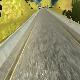

# **Behavioral Cloning**

**Behavrioal Cloning Project**

The goals / steps of this project are the following:
* Use the provided data set of good driving behavior in the simulator
* Build, a convolution neural network in Keras that predicts steering angles from images
* Train and validate the model with a training and validation set
* Test that the model successfully drives around track one without leaving the road
* Summarize the results with this written report

---
### Files Submitted & Code Quality

#### 1. Submission includes all required files and can be used to run the simulator in autonomous mode

My project includes the following files:
* model.py containing the script to create and train the model
* drive.py for driving the car in autonomous mode
* model.jason containing a trained convolution neural network
* model.h5 containing the weights after training
* writeup_report.md this report summarizing the results

#### 2. Submssion includes functional code
Using the Udacity provided simulator and my drive.py file, the car can be driven autonomously around the track by executing
```sh
python drive.py model.json
```

#### 3. Submssion code is usable and readable

The model.py file contains the code for training and saving the convolution neural network and weights. The file shows the pipeline I used for training and validating the model, and it contains comments to explain how the code works.

---

### Model Architecture and Training Strategy

#### 1. An appropriate model architecture has been employed

My model is based on the [Nvidia model architecture](http://images.nvidia.com/content/tegra/automotive/images/2016/solutions/pdf/end-to-end-dl-using-px.pdf). It is a CNN with a initial normalization, five convolutional layers and four fully-connected layers that takes and image and has a steering angle as output. (model.py lines 19 to 87)

The model includes ELU layers to introduce nonlinearity and the data is normalized by a Batch Normalization layer (code line 37).

*Architecture:*

Layer | (type) | Output Shape     
----- | ------ | -----
batchnormalization_1 | (BatchNormalization) | (None, 80, 80, 3)
convolution2d_1 | (Convolution2D) | (None, 38, 38, 24)
elu_1 | (ELU) |                     (None, 38, 38, 24)
convolution2d_2 | (Convolution2D) | (None, 17, 17, 36)
elu_2 | (ELU) |                    (None, 17, 17, 36)
dropout_1 | (Dropout) |             (None, 17, 17, 36)
convolution2d_3 | (Convolution2D) | (None, 7, 7, 48)
elu_3 | (ELU)  |                    (None, 7, 7, 48)
dropout_2 | (Dropout) |             (None, 7, 7, 48)
convolution2d_4 | (Convolution2D) | (None, 3, 3, 64)
elu_4 | (ELU) |                     (None, 3, 3, 64)
dropout_3 | (Dropout) |             (None, 3, 3, 64)
convolution2d_5 | (Convolution2D) | (None, 1, 1, 64)
elu_5 | (ELU) |                     (None, 1, 1, 64)
dropout_4 | (Dropout) |             (None, 1, 1, 64)
flatten_1 | (Flatten)  |            (None, 64)
dense_1 | (Dense) |                 (None, 1164)
dropout_5 | (Dropout)  |            (None, 1164)
elu_6 | (ELU) |                     (None, 1164)
dense_2 | (Dense) |                 (None, 100)
dropout_6 | (Dropout) |             (None, 100)
elu_7 | (ELU) |                     (None, 100)
dense_3 | (Dense) |                 (None, 50)
dropout_7 | (Dropout) |             (None, 50)
elu_8 | (ELU) |                     (None, 50)
dense_4 | (Dense) |                 (None, 10)
elu_9 | (ELU) |                     (None, 10)
dense_5 | (Dense) |                 (None, 1)


Total params: 329,091  
Trainable params: 329,085  
Non-trainable params: 6  


*Keras representation of the CNN*

#### 2. Attempts to reduce overfitting in the model

The model contains dropout layers after every convolution layer and the first three fully connected layers in order to reduce overfitting.

The model was trained and validated on different data sets (75% / 25%) to ensure that the model was not overfitting (train/validation split at line 203). The model was tested by running it through the simulator and ensuring that the vehicle could stay on the track on circuit one.

#### 3. Model parameter tuning

I tried to tune the model by trying different drop out rates, number of epochs and probabilities distributions of the camera picking. I found that a uniform probability distribution worked be and resulted in less zick-zacking and leaving the track. There was a trade of between drop out rate and the number of epochs. With a high drop out rate the model would diverge after certain amount of epochs. The difference in training and validation error has to be considered as well.

After many tries and many unsuccessful drives on the track, I settled on a drop out rate of 30%, 8 epochs and around 0.025 test and validation error.

The model used an adam optimizer, so the learning rate was not tuned manually (model.py line 216).  I used the adam optimizer as a beefed up version of gradient decent, which has worked well for my in other projects.

#### 4. Appropriate training data

Training data was chosen to keep the vehicle driving on the road. I used the data set provided by Udacity. Images of the different cameras were used with equal probability (line 139). The steering angle for the images from the right and left camera were adjusted (line 105) and used as recovery data.





*Examples of preprocessed Images*

---

### Model Architecture and Training Strategy

#### 1. Solution Design Approach

The overall strategy for deriving a model architecture was to take the successful Nvidia architecture and tweak for my purposes. I added the steering angle output layer, elu and drop put layers to the model. The elu layers were added to account for non linearities, while the drop out layers should prevent overfitting.

I did a lot of research on the experience of student from the first chord and try to leverage their knowledge. Especially the work of [Subodh Malgonde](https://github.com/subodh-malgonde/behavioral-cloning/blob/5ed2fefa4fea52583150b3a70e20fe09a6c11150/model.py), [Vivek Yadava](https://chatbotslife.com/learning-human-driving-behavior-using-nvidias-neural-network-model-and-image-augmentation-80399360efee#.qc7svcryi), and [Valipour Mojtaba](https://medium.com/@ValipourMojtaba/my-approach-for-project-3-2545578a9319#.byc7ui6hx). I implemented parts of their image preprocessing for the training data (see below) and the generator function.

At the end of the process, the vehicle is able to drive autonomously around the track without leaving the road.

#### 3. Creation of the Training Set & Training Process

I used the data set that was provided by Udacity to create my training and validation set.

Additionally I introduced preprocessing of the images. I cropped them to the area of interest (street) and resized them to reduce computing time (line 126). To counter the left skew in the data from a counterclockwise circuit, I added a 50% chance of flipping the image (an the corresponding steering angle (line 116)). This balanced the training and validation sets.


*Histogram of original Steering Angles*

The balanced and preprocessed data was feed into a generator function (line 164) that created batches for training and validation (line 231).

I experimented with different batch size and found that 32 was a good compromise between computing time and stability in the  optimizers performance.
